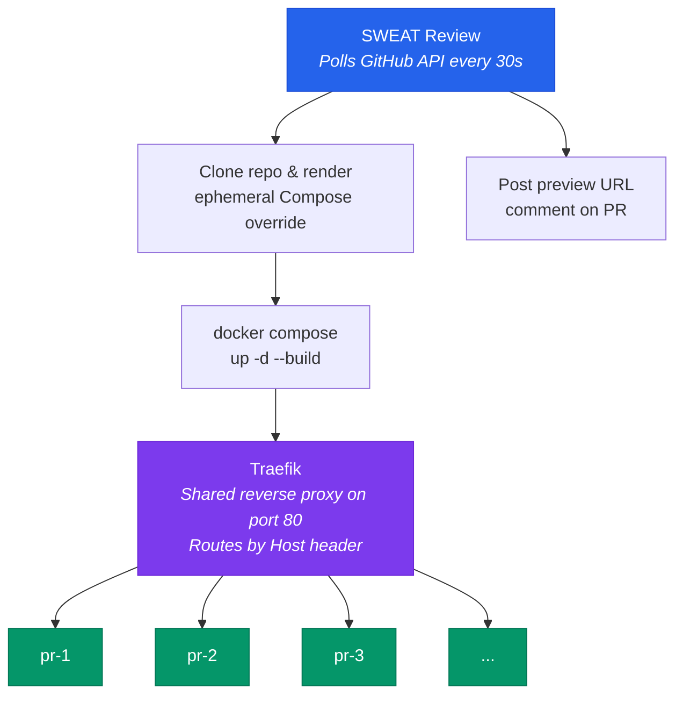

# SWEAT Review

Self-hosted ephemeral preview environments for GitHub pull requests.

Spins up an isolated ephemeral Docker Compose stack per PR on a VPS, routes traffic via
subdomains using Traefik, and posts the preview URL as a GitHub PR comment.

## How it works



Each PR gets its own fully isolated stack (frontend, backend, nginx, database,
workers — whatever your `docker-compose.yml` defines). Traffic is routed via
subdomain:

```
http://pr{N}.{VPS_IP}.nip.io
```

[nip.io](https://nip.io) provides wildcard DNS that maps any subdomain
containing an IP back to that IP — no domain registration or DNS config needed.

The agent polls the GitHub API for open PRs every 30 seconds (configurable) and:

1. **New PR detected** — clones the branch, renders a Compose override with
   Traefik labels, runs `docker compose up`, posts the preview URL on the PR
2. **PR updated** (new commits pushed) — pulls latest, rebuilds changed services
3. **PR closed** — tears down the stack, removes the clone, updates the PR comment

No webhook configuration needed — the agent works behind NAT, firewalls, or
locally on your machine.

## Prerequisites

- **Docker** and **Docker Compose** installed
- **Python 3.12+** (or just use [uv](https://docs.astral.sh/uv/) / [uvx](https://docs.astral.sh/uv/guides/tools/))
- A **GitHub personal access token** (see [Token setup](#github-token-setup) below)

## Quick start

### 1. Initialize

```bash
uvx sweat-review init
```

This prompts for your GitHub token, repo, and VPS IP, then writes `.env`,
creates the Traefik reverse proxy config, sets up the Docker network, and
starts Traefik — all in one step.

### 2. Start

```bash
uvx sweat-review start
```

That's it. Open a PR on your target repo and wait up to 30 seconds — you'll
see a comment with the preview URL.

### Configuration reference

The `init` command writes a `.env` file with the essentials. You can edit it
to tune additional settings:

| Variable | Description | Default |
|----------|-------------|---------|
| `GITHUB_TOKEN` | GitHub PAT for PR comments and repo cloning | (required) |
| `GITHUB_REPO` | Target repository as `owner/repo` | (required) |
| `VPS_IP` | IP address for preview URLs | `127.0.0.1` |
| `POLL_INTERVAL` | Seconds between GitHub API polls | `30` |
| `CLONE_BASE_DIR` | Directory where PR repos are cloned | `/tmp/preview-agent` |
| `MAX_CONCURRENT` | Maximum simultaneous preview environments | `15` |
| `STALE_TIMEOUT_HOURS` | Hours before a deployment is considered stale | `48` |
| `DB_PATH` | Path to the SQLite state database | `preview_agent.db` |
| `COMPOSE_FILE` | Name of the Compose file in the target repo | `docker-compose.yml` |
| `TARGET_ENV_FILE` | Path to an env file to copy into each preview environment | (optional) |
| `TEMPLATE_PATH` | Path to the Jinja2 override template | `templates/docker-compose.override.yml.j2` |

### Environment variables for the target project

If your target project needs a `.env` file (e.g. database credentials, API keys),
you can't commit it to the repo. Instead, store it on the machine running the
agent and point to it:

```bash
# In your preview-agent .env:
TARGET_ENV_FILE=/path/to/my-project.env
```

The agent copies this file as `.env` into each PR's clone directory before
running `docker compose up`. It's refreshed on every update too, so changes
to the file take effect on the next PR push.

If `TARGET_ENV_FILE` is not set, the agent skips this step.

### GitHub token setup

The agent needs a GitHub token to poll for PRs, clone repos, and post comments.
You can use either a **fine-grained personal access token** (recommended) or a
classic token.

**Fine-grained token** (recommended) — go to
**Settings > Developer settings > Personal access tokens > Fine-grained tokens**:

| Permission | Access | Used for |
|------------|--------|----------|
| **Contents** | Read | Cloning the PR branch |
| **Pull requests** | Read | Polling for open PRs and checking PR state |
| **Issues** | Write | Posting and updating preview URL comments (GitHub serves PR comments via the Issues API) |

Set **Repository access** to "Only select repositories" and pick your target repo.

**Classic token** — go to
**Settings > Developer settings > Personal access tokens > Tokens (classic)**:

Select the `repo` scope (grants full access to private repos — less granular
than fine-grained tokens).

## Validate your Compose file

Before opening a PR, you can check your `docker-compose.yml` for
preview-compatibility issues:

```bash
uvx sweat-review check
```

Use `-f` to point at a different file, or `--format json` for machine-readable
output.

## API endpoints

| Method | Path | Description |
|--------|------|-------------|
| `GET` | `/health` | Health check with disk info |
| `GET` | `/status` | List all tracked deployments |
| `GET` | `/status/{pr_number}` | Get a single deployment's status |

## Testing

### Run the test suite

```bash
uv sync --all-groups
uv run pytest -v
```

46 tests covering state store, compose rendering, orchestrator, poller, cleanup,
resource checks, and integration.

### Manual test with the sample app

A sample multi-service app is in `sample-app/` for testing Traefik routing
without needing a real repo:

```bash
# 1. Make sure Traefik is running (sweat-review init starts it)

# 2. Render an override for "PR 1"
uv run python -c "
from preview_agent.compose import ComposeRenderer
from pathlib import Path
r = ComposeRenderer(Path('templates/docker-compose.override.yml.j2'))
r.write_override(Path('sample-app'), pr_number=1, vps_ip='127.0.0.1')
"

# 3. Start the stack
docker compose -p pr-1 \
  -f sample-app/docker-compose.yml \
  -f sample-app/docker-compose.override.yml \
  up -d --build

# 4. Test it
curl -H "Host: pr1.127.0.0.1.nip.io" http://localhost/api/health
# Expected: {"status":"ok","service":"backend"}

# 5. Tear down
docker compose -p pr-1 down -v --remove-orphans
```

## Target repo requirements

Your project needs a `docker-compose.yml` with an **nginx** service as the
entry point. If your entry point service has a different name, edit
`templates/docker-compose.override.yml.j2` and replace `nginx` with your
service name.

## Project structure

```
├── pyproject.toml                          # Package config + CLI entry point
├── .env.example                            # Environment variable template
├── src/preview_agent/
│   ├── main.py                             # FastAPI app + CLI entry point
│   ├── config.py                           # Settings loaded from env vars
│   ├── poller.py                           # Polls GitHub API for PR changes
│   ├── orchestrator.py                     # Deploy / update / teardown logic
│   ├── compose.py                          # Jinja2 override template rendering
│   ├── github_client.py                    # GitHub API client (PRs + comments)
│   ├── state.py                            # SQLite deployment state tracking
│   ├── resources.py                        # Disk/memory resource checks
│   └── cleanup.py                          # Stale + orphan cleanup scheduler
├── templates/
│   └── docker-compose.override.yml.j2      # Per-PR Compose override with Traefik labels
├── traefik/
│   └── docker-compose.yml                  # Shared Traefik reverse proxy
├── sample-app/                             # Minimal multi-service app for testing
│   ├── docker-compose.yml
│   ├── backend/                            # Flask API
│   ├── frontend/                           # Static HTML
│   └── nginx/                              # Reverse proxy
└── tests/                                  # 46 tests
```
